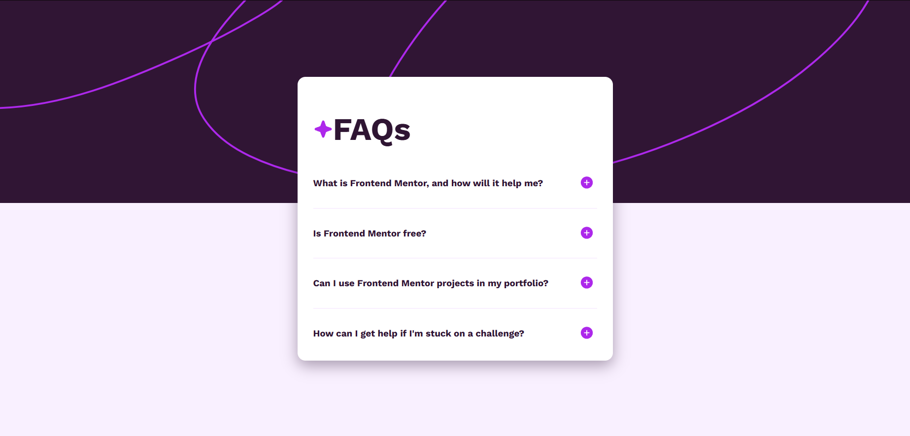

# Frontend Mentor - FAQ accordion solution

This is a solution to the [FAQ accordion challenge on Frontend Mentor](https://www.frontendmentor.io/challenges/faq-accordion-wyfFdeBwBz). Frontend Mentor challenges help you improve your coding skills by building realistic projects. 

## Table of contents

- [Overview](#overview)
  - [The challenge](#the-challenge)
  - [Screenshot](#screenshot)
  - [Links](#links)
- [My process](#my-process)
  - [Built with](#built-with)
  - [What I learned](#what-i-learned)
  - [Continued development](#continued-development)
  - [Useful resources](#useful-resources)
- [Author](#author)
- [Acknowledgments](#acknowledgments)

## Overview

### The challenge

Users should be able to:

- Hide/Show the answer to a question when the question is clicked
- Navigate the questions and hide/show answers using keyboard navigation alone
- View the optimal layout for the interface depending on their device's screen size
- See hover and focus states for all interactive elements on the page

### Screenshot



### Links

- Solution URL: [See my solution here](https://github.com/juliettedb-v/faq-accordion-main)
- Live Site URL: [FAQ Accordion Main](https://juliettedb-v.github.io/faq-accordion-main/)

## My process

### Built with

- Semantic HTML5 markup
- CSS custom properties
- Flexbox
- CSS Grid
- JavaScript Vanilla

### What I learned
Honestly, I'm learning JavaScript so this was the most difficult part, not only open/closing questions but changing the icons as doing so. I learned about toggles, using querySelectorAll as an array and use index in my favour. It was a whole experience and I've learned so much thanks of it. I'm building more projects so keep looking at my account!

```css
@media (width <= 431px) {
    .container {
        padding: 0 1rem 0 1rem;
    }

    .content-container {
        width: 100%;
        min-height: 100%;
    }
    .title {
        font-size: 24px;
        margin: 0 0 1rem 0;
    }

    .background-pattern img {
        display: none;
    }
    
}
```

```js
const faqQuestions = document.querySelectorAll('.faq-question');
const faqAnswers = document.querySelectorAll('.faq-answer');
const toggleButtons = document.querySelectorAll('.toggle-btn');

// Add event listeners to each FAQ question

// Listener solo una vez al cargar
faqQuestions.forEach((question, index) => {
  question.addEventListener('click', () => {
    faqAnswers[index].classList.toggle('hidden');
    question.classList.toggle('active');

    // Cambiar iconos según el estado
    const icon = toggleButtons[index].querySelector('img');
    if (faqAnswers[index].classList.contains('hidden')) {
      icon.src = './assets/images/icon-plus.svg';
      icon.alt = 'Expand answer';
    } else {
      icon.src = './assets/images/icon-minus.svg';
      icon.alt = 'Collapse answer';
    }
  });
});

```


### Continued development

I'm starting to learn more of responsive design and I'm excited to learn more about Figma, they've recently announced some great features and I know frontend is going to change a lot in the near future. I'm excited to keep learning and see more of what can AI do for us.

### Useful resources

- [Media Queries on mdn web docs](https://developer.mozilla.org/en-US/docs/Web/CSS/CSS_media_queries/Using_media_queries) - This helped me to understand more about media queries. I really how I applied it.

## Author

- Website - [Juliette]()
- Frontend Mentor - [@juliettedb-v](https://www.frontendmentor.io/profile/juliettedb-v)


## Acknowledgments

Taking Platzi's courses really helped me out to understand basic knowledge that I needed for completing this challenge. I know it's helpful for a lot of hispanics out there and I highly recommend it.
